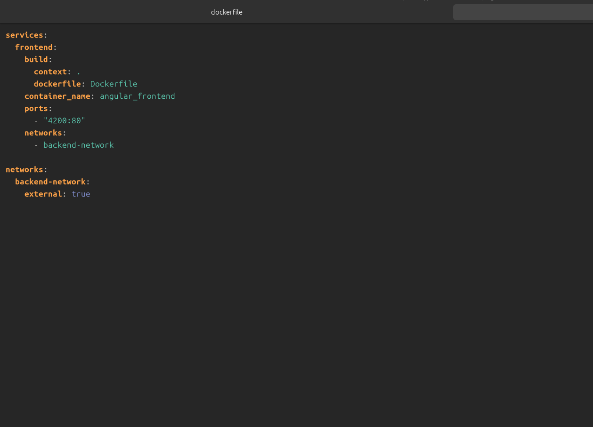

# Despliegue del Frontend con Docker y Docker Compose

Este documento describe paso a paso el proceso seguido para **construir y desplegar el frontend** utilizando **Docker** y **Docker Compose**.

## Paso 1: Crear el **Dockerfile**

El `Dockerfile` está dividido en **dos etapas**:

1. **Etapa de construcción (Node.js 20)**
   * Instala dependencias con `npm install`.
   * Copia el código fuente.
   * Compila la aplicación en modo producción con `npm run build --prod`.

2. **Etapa de despliegue (Nginx)**
   * Usa `nginx:stable-alpine` como servidor web.
   * Copia el resultado del build (`/app/dist`) a la carpeta donde Nginx sirve archivos estáticos.
   * Expone el puerto `80` para que la aplicación esté disponible.

**Propósito:** generar una imagen ligera que compile y sirva el frontend en producción.


## Paso 2: Crear el archivo **docker-compose.yml**

El `docker-compose.yml` define cómo se levanta el contenedor del frontend. En mi caso incluye:

* **Servicio** `frontend` que se construye a partir del `Dockerfile`.
* Nombre de contenedor: `angular_frontend`.
* Puerto mapeado: `4200` (host) → `80` (contenedor).
* Red `backend-network` para comunicarse con el backend.

**Propósito:** levantar el frontend de forma sencilla y conectado a la misma red del backend.



## Paso 3: Construir y levantar el frontend

Dentro de la carpeta donde están el `Dockerfile` y el `docker-compose.yml`, ejecutar:

```bash
docker compose up -d --build
```


**Propósito:** compilar la imagen, crear el contenedor y ejecutarlo en segundo plano.

## Paso 4: Acceder al frontend

Una vez levantado el contenedor, la aplicación estará disponible en:

**http://localhost:4200**

**Propósito:** verificar que el frontend está desplegado correctamente y accesible desde el navegador.

## Evidencias de despliegue

En esta sección se mostrarán capturas de pantalla para evidenciar que el despliegue se realizó correctamente:

* Contenedor `angular_frontend` corriendo.


* Acceso al frontend desde el navegador y haciendole peticiones al backend desplegado.


