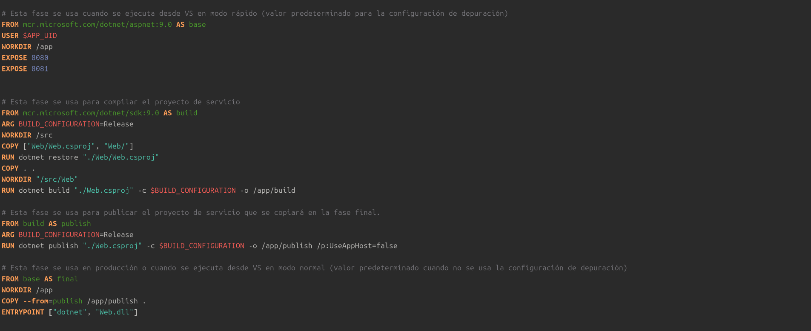
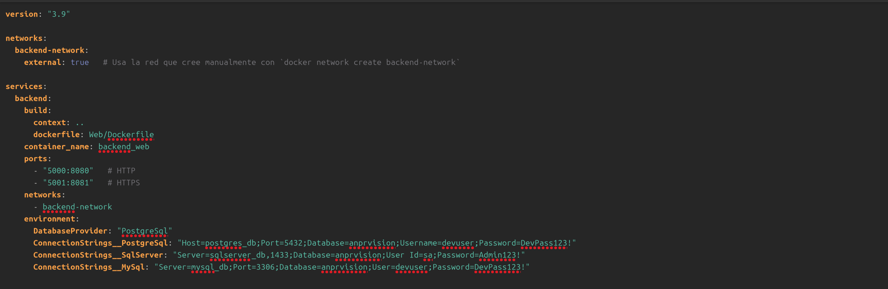
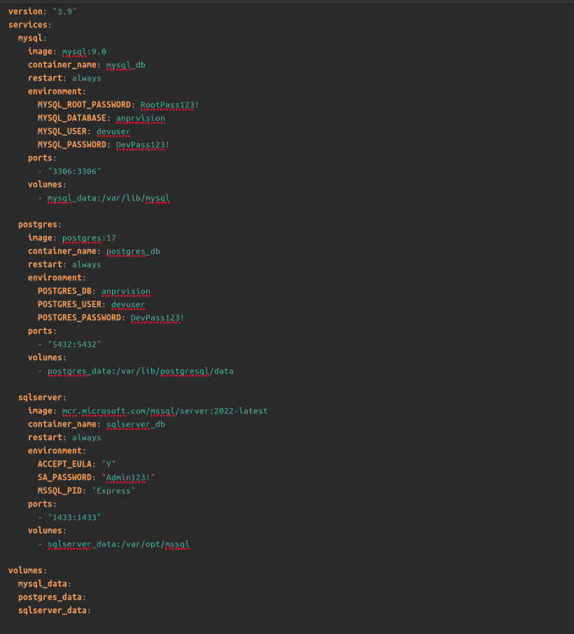
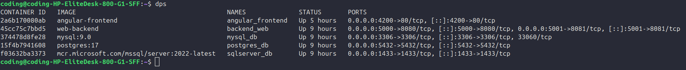
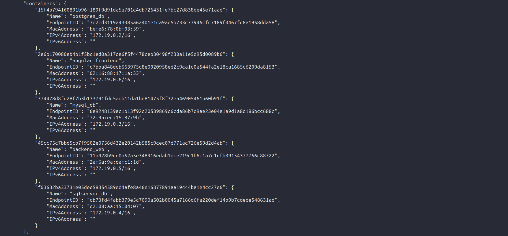
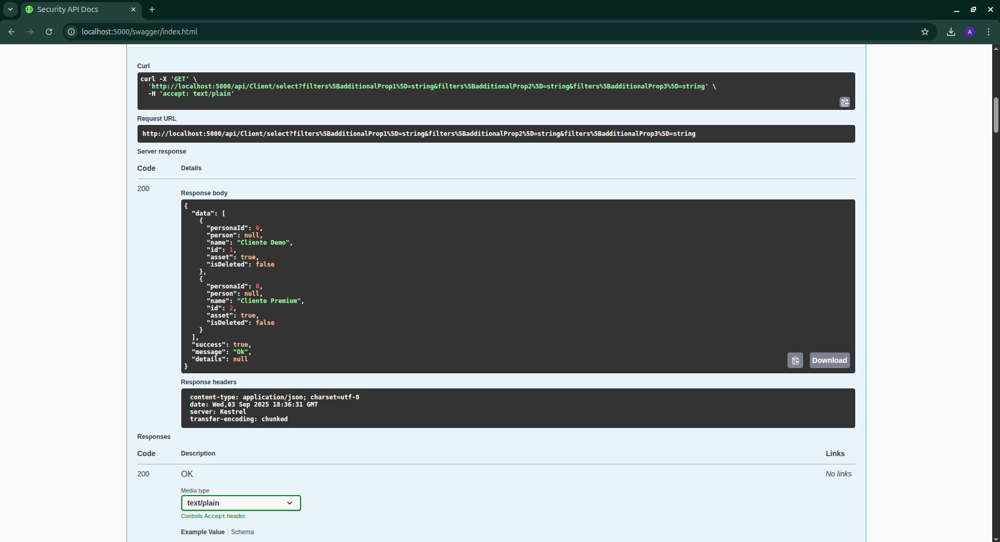

#  Despliegue de backend con Docker y Docker Compose

Este documento describe paso a paso el proceso seguido para **crear y desplegar el backend** utilizando **Docker** y **Docker Compose**.

##  Paso 1: Crear el **Dockerfile**

El `Dockerfile` se utiliza para definir la imagen de mi backend. En él se especifican las instrucciones necesarias para:

* Indicar la imagen base a utilizar.
* Copiar el código fuente dentro del contenedor.
* Instalar dependencias necesarias.
* Definir el comando de arranque de la aplicación.


**Propósito:** tener una imagen lista y portable que contenga todo lo necesario para ejecutar el backend en cualquier entorno.


##  Paso 2: Crear el archivo **docker-compose.yml**

El archivo `docker-compose.yml` se usa para orquestar y levantar los distintos servicios de manera sencilla. En este archivo se definen:

* Los contenedores que se van a ejecutar (backend, bases de datos, etc.).
* Las redes de comunicación entre ellos.
* Los volúmenes para persistencia de datos.

**Propósito:** facilitar la ejecución de múltiples contenedores con un solo comando.



## Paso 3: Crear una red compartida

Para que los distintos contenedores (bases de datos y backend) puedan comunicarse entre sí, es necesario crear una red de Docker. Esto se hace una sola vez:

```bash
docker network create backend-network
```

**Propósito:** permitir que los contenedores se comuniquen entre sí de manera aislada y segura.

## Paso 4: Levantar las bases de datos

Con el siguiente comando se levantan las bases de datos definidas en el archivo `docker-compose.databases.yml`:

```bash
docker compose -f docker-compose.databases.yml up -d
```

 **Propósito:** tener las bases de datos corriendo en contenedores separados y listas para conectarse al backend.
 

##  Paso 5: Conectar las bases de datos a la red del backend

Para que el backend pueda acceder a las bases de datos, se conectan los contenedores a la red creada previamente:

```bash
docker network connect backend-network postgres_db
docker network connect backend-network mysql_db
docker network connect backend-network sqlserver_db
```

**Propósito:** asegurar que las bases de datos y el backend estén en la misma red y puedan comunicarse.

## Paso 6: Levantar el backend

Finalmente, se despliega el backend desde la carpeta correspondiente:

```bash
cd Web
docker compose up -d
```

**Propósito:** ejecutar la aplicación backend en un contenedor Docker, lista para conectarse con las bases de datos.

## Paso 7: Evidenciar que todo este corriendo bien
aca podemos ver que los contenedores estan corriendo y tambien vemos los puertos que estan usando:



por ahora solo fijarnos en el contenedor web-backend que es el despliegue que acabamos de hacer del backend y de los contenedores de las bases de datos

si ahora mismo usamos el comando docker network inspect + el nombre de la network en este caso:
```bash
 docker network inspect backend-network
```
veremos la informacion de la red que creamos y en el apartado de container veremos los containers que actualmente estan conectados a esa red:



## Evidencia de que la API esta funcionando correctamente:

Podemos ver que el puerto es el que estamos usando en el contenedor: 


